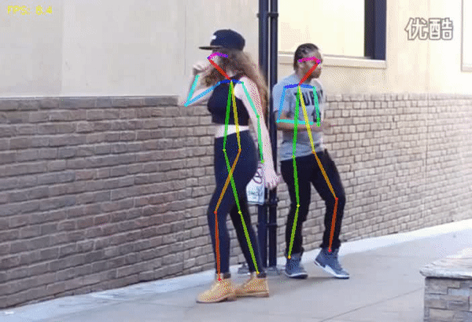

# Real-time-human-pose-estimation-by-pytorch

A reimplementation of real time human pose estimation using Pytorch. Both [CMU's original model](https://arxiv.org/abs/1611.08050) and [mobilenet version](https://arxiv.org/pdf/1811.12004.pdf) backbone are provided. 

In order to speed up the code, instead of resizing heat maps and PAF maps to orignial input image, this code upsamples the feature map with factor 8 and then performed the NMS for peak location, bigartite grahps, line integral and grouping. 

**You can reach 15+ frames per second using GPU**

## Demo

CPU: Intel® Xeon(R) W-2123 @ 3.60GHz × 8 </br>
GPU: Nvidia Quadro P4000 8G </br>
Input Video Size: 640x480

| CMU's Original Model on CPU | Mobilenet on CPU |
|:---------|:--------------------|
|||
| **~4 FPS** | **~8 FPS** |

| CMU's Original Model on GPU | Mobilenet on GPU |
|:---------|:--------------------|
|||
| **~10 FPS** | **~15 FPS** |

## Model Download 

download the [CMU pretrained weight](https://pan.baidu.com/s/1M74ZtnsERToqx4MvT6czAA), [Mobilenet weight](https://pan.baidu.com/s/1bezyGZYYejGsUHZigbU9ag) and put into "weights" folder

## Inference 

* image Demo
```
$ python Demo_picture.py -backbone {CMU or Mobilenet} -image {image path} -scale {scale to image} -show {}
```
* Video Demo
```
$ python Demo_video.py -backbone {CMU or Mobilenet} -video {video path} -scale {scale to image} -show {}
```
"**-show**" provides an option to show the image with skeleton or a specific part location 

## Tutorial
refer to **Open_Pose_Step_by_Step.ipynb** for detailed instruction on how to implement openpose algorithm 

## Reference 
https://github.com/ZheC/Realtime_Multi-Person_Pose_Estimation
https://github.com/tensorboy/pytorch_Realtime_Multi-Person_Pose_Estimation
https://github.com/Hzzone/pytorch-openpose
https://github.com/Daniil-Osokin/lightweight-human-pose-estimation.pytorch

